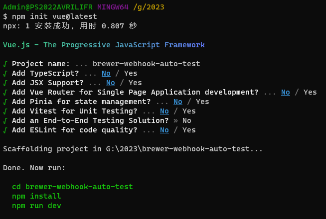
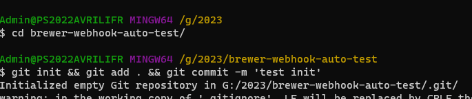
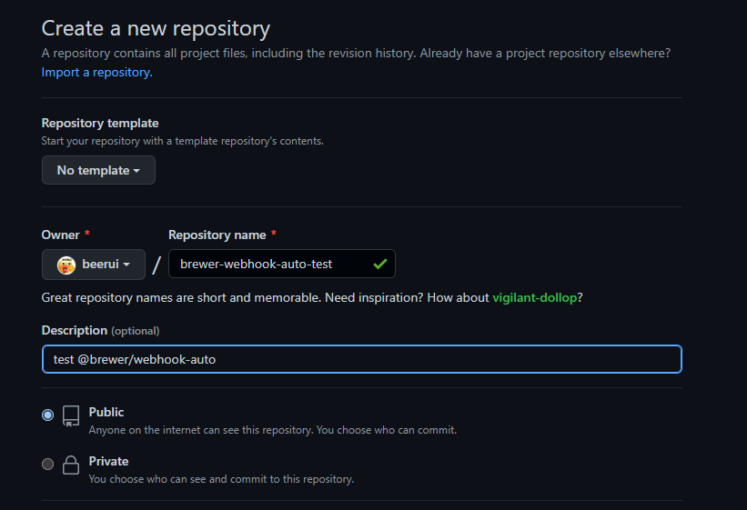
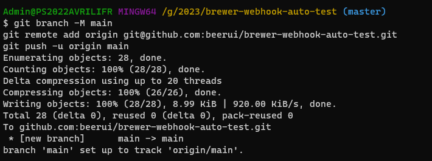
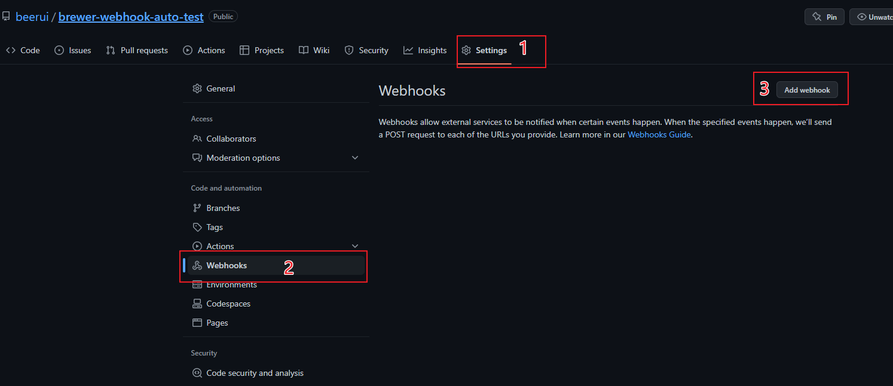
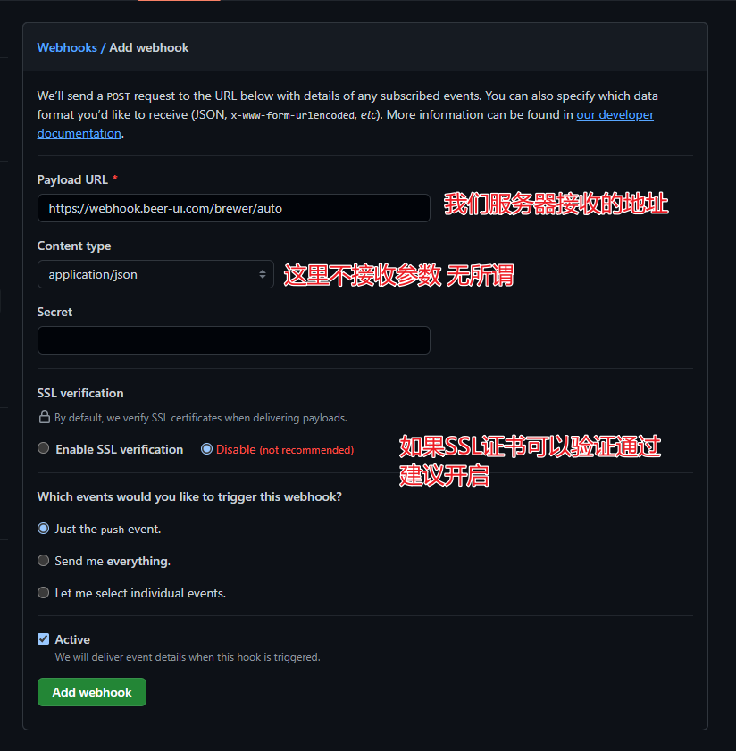

### Webhook 自动部署

### 开始
1. 在服务器中运行 `git clone `当前项目
2. 在当前项目根目录下，修改配置文件 `config.json`
#### 基础配置
``` json
{
  "port": 3002,                 // 服务端口号
  "app1": {                     // 项目一：app1是webhook添加的接口地址
    "name": "project1",         // 日志输出名称，预留的可以是pm2启动的服务名称
    "path": "./project1",       // 项目路径（真实地址要写绝对路径）
    "command": ""               // 额外运行的命令
  },
  "app2": {
    "name": "project2",
    "path": "./project2",
    "command": "cd /data/project2 && git pull origin main && npm i && npm run build"
  }
}
```
3. 配置完成后运行`pm2 start index.js --name wh`/`npm run dev`/`node index.js`
> 建议使用pm2来管理项目, wh=webhook
4. 日志查看 `tail -f ./logs/webhook.log`

### 示例
新建一个项目测试项目

初始化git项目

git上新建项目 并推送上来


设置github项目中的webhook



以上配置完成之后，就可以使用我们的库了
首先，我们需要在服务器上拉取一个项目`git clone git@github.com:beerui/brewer-webhook-auto-test.git`
``` bash
cd /data/
git clone git@github.com:beerui/brewer-webhook-auto-test.git
cd brewer-webhook-auto-test
npm i && npm i @brewer/webhook-auto

```